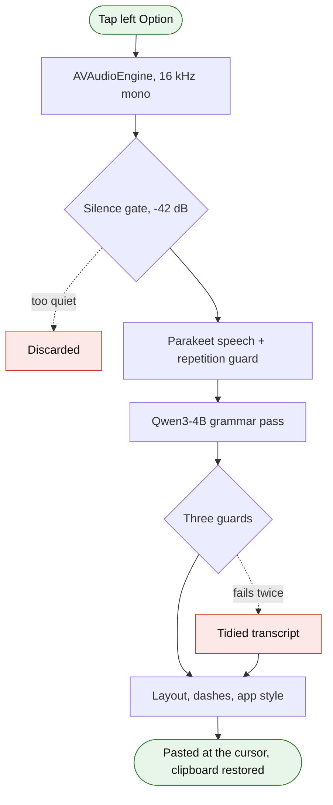

<div align="center">


# Phona

**Tap the left Option key, speak, tap it again. Your words arrive corrected, where the cursor is.**

Local dictation with a grammar pass, for Apple Silicon Macs.<br>
No account, no API key, no audio leaving your machine.

[](https://github.com/basal-john/phona/actions/workflows/ci.yml)
[](https://github.com/basal-john/phona/releases/latest)


[](LICENSE)


</div>

## What it does

You tap the left Option key and talk. Tap it again and Phona transcribes what you said, fixes
the grammar, and pastes the result into whatever app you were in.

```text
"there any way we can access these logs from the preference menu"
    -> Is there any way we can access these logs from the preference menu?

"we didn't found the root cause yet but we are investigating it since monday"
    -> We haven't found the root cause yet, but we have been investigating it since Monday.
```

The correction step is the point. Speech-to-text alone gives you exactly what you said,
including every dropped auxiliary and tense slip. That is fine for notes and wrong for a pull
request comment.

Everything runs on your Mac. Parakeet for speech, a 4B language model for the grammar pass,
both on Apple's MLX. Your voice never reaches a server, so it is safe for work you would not
paste into a web form. It is also fast, because there is no network round trip.

| | |
| --- | --- |
| **Transcription**, short utterance | ~0.75 s |
| **Grammar pass** | ~0.40 s |
| **Second tap to text on screen** | **~1.2 s** |
| **Needs** | Apple Silicon (M1 or later), macOS 14 or later, ~6.5 GB disk for the models |

## Install

```bash
git clone https://github.com/basal-john/phona.git
cd phona
./install.sh                                  # speech engine and models
cd macapp && ./build.sh && open build/Phona.app
```

Or take `Phona.dmg` from [Releases](https://github.com/basal-john/phona/releases/latest), drag
it to Applications, and still run `install.sh` from this repo for the engine.

<details>
<summary><b>First run</b>, two permissions and one Gatekeeper warning</summary>

<br>


Phona asks for two permissions and explains why:

- **Accessibility** so it can notice the Option key and type into your apps
- **Microphone** so it can hear you

Both are granted in System Settings, and the setup window ticks each one green the moment it
lands. Nothing else to configure.

Because the app is signed ad-hoc rather than with a paid Apple Developer ID, macOS shows a
warning the first time. Right click the app, choose Open, then Open again. Once only.

</details>

## Using it

Tap the **left Option** key on its own, speak, tap it again. That is the whole interface.
Escape throws the recording away. Resting on the key does nothing, and the right Option key
is never a hotkey, so every Option shortcut you already use keeps working. The
[design notes](docs/decisions.md#the-hotkey) explain how.

| While you talk | After the second tap | When it lands |
| --- | --- | --- |
|  |  |  |
| live waveform of your voice | transcribing and correcting | pasted at the cursor |

The waveform is your actual input level, not a decorative loop. If it stays flat while you
talk, the microphone is not picking you up.

Four sounds tell you the same story without looking: **start** rises, **stop** is a single
short note confirming the tap was heard, **done** resolves an octave up, and **nothing** is
the start cue reversed, meaning no speech in the take.

The menu bar keeps your recent dictations. Click one to copy it back, or hover to see what the
transcriber actually heard before correction, which is how you tell a mishearing from a bad
correction.

## What the correction pass does

One pass, nothing to choose. It fixes grammar, agreement, tense and punctuation, drops the
half-sentence you abandoned, resolves the word you reached for twice, splits a spoken run-on,
and never uses an em dash.

```text
"yeah usually i use yes i do have a mac and usually i use the xcode signing but the only
 issue is that i am too lazy to remind remember about it and resign it every seven days
 that i hate the most"

-> Usually I use the Xcode signing. I do have a Mac. The only issue is that I'm too lazy
   to remember to resign it every seven days. That's the thing I hate the most.
```

A local model asked to correct a sentence will sometimes answer it instead. Three guards sit
in front of that, and every correction clears all three: it may not lose a stretch of what you
said, it may not name a thing you did not name, and the wording may not move too far from
yours. A failed check gets one retry with the rule restated, and if that fails too you get the
tidied transcript, because your own words are safer than invented ones.

Filler, stutters and the spoken run-up are cut in code rather than by asking the model, which
kept putting them back. The measurements behind each rule are in
[docs/decisions.md](docs/decisions.md#the-correction-pass).

<details>
<summary><b>Layout</b>, spoken commands and automatic paragraphs</summary>

<br>

Count items off and they come back as a list. "there are three things, first the config needs
an update, second the tests are failing, third someone has to review the PR" gives you:

```text
There are three things:
1. The config needs an update.
2. The tests are failing.
3. Someone has to review the PR.
```

For the rest, say the break you want as a sentence of its own:

| Say | Get |
| --- | --- |
| `new paragraph` | a blank line |
| `new line`, `next line`, `line break` | a line break |
| `bullet point`, `new bullet` | a new `- ` item |

A long dictation also gets paragraph breaks without being asked, and a break only ever lands
where you had already stopped talking. Turn the whole thing off with **Act on spoken layout
commands** in Settings.

</details>

<details>
<summary><b>Phona reads the app in front</b>, so chat and mail come out differently</summary>

<br>

Nobody types a full stop at the end of a Slack message, so a dictated one reads stiffer than
anything you would have written by hand. Dictate into a chat app and the closing stop is
dropped:

| Say | Get |
| --- | --- |
| "I pushed the fix, the tests are green" | `I pushed the fix. The tests are green` |
| "can you check the staging build" | `Can you check the staging build?` |

Slack, Discord, WhatsApp, Teams and Messages count, and so do the same sites in a browser.
Only the final full stop goes. Question marks, exclamation marks, stops between sentences and
abbreviations are all left alone.

Mail goes the other way. Dictate into Mail, Outlook, Superhuman or a webmail tab and "I don't
think we're ready" arrives as "I do not think we are ready". Only contractions change, so the
mail version says exactly what the chat version says.

Measured over 271 real dictations: 159 would lose their closing stop, 112 were left exactly as
they were, and the single message ending in an abbreviation kept its own. Turn it off with
**Drop the closing full stop** in Settings.

</details>

<details>
<summary><b>Everything else goes quiet</b> while you dictate</summary>

<br>

Music, a video in a browser tab or a voice on a call reaches the microphone through the room,
and the transcriber cannot tell that speech apart from yours. So the output device is muted
while you are being recorded and set back the moment you let go.

This includes call audio: dictate during a meeting and you stop hearing the room for as long
as the dictation is running. Turn it off with **Mute other audio** in Settings.

</details>

## How it works



The Swift app owns the interface and the audio. A small Python daemon holds the two models
warm in memory and answers over a unix socket, which is what keeps a dictation at about a
second instead of reloading several gigabytes each time. The daemon prefills a KV cache with
the fixed prompt prefix, which cut the grammar pass from 1.35 s to 0.40 s.

| Job | Model | Size | Why |
| --- | --- | --- | --- |
| speech | `mlx-community/parakeet-tdt-0.6b-v3` | 2.4 GB | ties Whisper on word error rate at a third of the cost |
| grammar | `mlx-community/Qwen3-4B-Instruct-2507-8bit` | 4.1 GB | won a four-model comparison on precision, not on repairs |

Both are swappable. Edit `stt_model` or `llm_model` in `config.json` and run `phona restart`,
or use `./switch-model.sh`. The backend is picked from the repo id, so naming a Whisper repo
loads Whisper and needs no other change. A larger grammar model raises quality and roughly
doubles latency.

```bash
phona models          # what is loaded, at which revision, and whether the hub has moved
phona update-models   # fetch newer weights, then restart
```

Revisions are pinned once a model is cached, so a restart cannot silently pick up new weights.
The comparisons, the numbers behind them and the reason for pinning are in
[docs/decisions.md](docs/decisions.md#the-models).

## Settings

<details>
<summary>The Settings window, and the config file behind it</summary>

<br>

**Settings window**, applied on the next dictation:

| Setting | What it does |
| --- | --- |
| When done | insert at cursor, copy to clipboard, or both |
| Act on spoken layout commands | `new paragraph`, `new line`, `bullet point` |
| Drop the closing full stop | in chat apps only |
| Mute other audio | while recording |
| Vocabulary | words the transcriber mangles, one per line |
| Replacements | literal fixes as `wrong = right`, applied before the layout pass |
| Show Phona in the Dock, Open Phona at login | |

**`~/.local/share/phona/config.json`**, read once at daemon startup, so run `phona restart`
after editing:

| Key | Default | Meaning |
| --- | --- | --- |
| `stt_model` | see the table above | any mlx-community Parakeet or Whisper repo |
| `llm_model` | see the table above | any mlx-lm chat model |
| `language` | `en` | `auto` to detect, `de` for German. Whisper only |
| `input_device` | `:default` | avfoundation index, for example `:1` |
| `silence_max_db` | `-42.0` | quieter than this counts as silence |
| `max_words_per_second` | `6.0` | above this the transcript is treated as noise |
| `min_seconds` | `0.4` | shorter recordings are a slip of the key |
| `max_seconds` | `300` | hard cap on one recording |
| `device_open_timeout` | `6.0` | seconds to wait for the input to produce audio |
| `use_initial_prompt` | `false` | bias Whisper with the dictionary. Ignored by Parakeet |
| `dictionary` | `["Phona"]` | vocabulary hint, only used when the flag above is on |
| `replacements` | `{}` | literal fixes, for example `{"jeera": "Jira"}` |
| `spoken_layout` | `true` | act on spoken layout commands |
| `self_correction` | `true` | resolve a correction you spoke aloud |
| `keep_audio_days` | `0` | keep each recording this many days under `audio/`, pruned on every run |
| `pin_models` | `true` | load the cached snapshot instead of re-resolving the hub |
| `model_update_check` | `true` | ask the hub whether the pinned weights are behind. Reports only |
| `sounds` | `true` | audio cues |

`keep_audio_days` is for comparing two speech models honestly, or triaging a misheard word.
Set it back to `0` when you are done. See
[docs/decisions.md](docs/decisions.md#keeping-recordings-for-a-comparison).

</details>

## Your data

Everything stays on your Mac, in `~/.local/share/phona`:

| File | What is in it |
| --- | --- |
| `history.jsonl` | every dictation, in plain text, with what was heard and what was returned |
| `corrections.jsonl` | the ones you flagged as wrong |
| `config.json` | your settings, vocabulary and replacements |
| `phonad.log`, `app.log` | diagnostics |

Worth being explicit about, because it is the obvious consequence of a local tool and still a
surprise if nobody says it: the history is a plain text record of everything you have
dictated, readable by anything running as you. Nothing is encrypted and nothing is uploaded.
Delete `history.jsonl` whenever you like, the app recreates it.

Audio is not kept. Each recording is written to a temporary file and deleted as soon as it has
been transcribed, unless you set `keep_audio_days`.

## Keeping it honest

Dictation goes wrong in ways the log cannot see on its own. It records what was heard and what
was returned, never what you meant, so a mishearing between two real words is invisible to it.
When a dictation comes out wrong, flag it:

```bash
phona wrong "what I actually said"     # the text is optional
```

Or use **Mark last dictation as wrong** in the menu bar. That is the only ground truth the tool
gets, and it is what makes the audit useful rather than guesswork.

```bash
~/.local/share/phona/venv/bin/python ~/.local/share/phona/audit.py --days 7
```

The audit separates what it knows from what it guessed. Entries you flagged, takes the silence
gate discarded and corrections the guard refused are facts the daemon recorded. Suspected
mishearings come from the local model and are labelled as inferences. It proposes replacements
and applies none of them until you say so, and a weekly run lands in
`~/.local/share/phona/audit-latest.md` on Monday mornings. Analysis uses the same local model
as everything else, so a scheduled audit does not quietly start uploading your dictations.

## Updating

```bash
cd phona && ./update.sh
```

Pulls, rebuilds the app, refreshes the engine and restarts it. Your settings, history and
flagged corrections live in `~/.local/share/phona` and are never touched. Permissions carry
over, because the signature is pinned to the bundle identifier rather than to the build.

Phona checks the releases feed once a day and adds an "Update available" item to the menu when
there is something newer. It never installs anything on its own. An app holding Accessibility
access should not replace its own binary without being asked.

## Tests

```bash
python -m pytest tests/ -q                      # logic and packaging, no model needed
cd macapp && swift test                         # version comparison
python tests/run_model_tests.py                 # the grammar suite, needs the engine running
python tests/eval_correction.py --run <label>   # score a model, needs the engine running
```

The first two run in CI on every push, on an Apple Silicon runner, in a couple of minutes. The
last two need the warm daemon and several gigabytes of models, so they stay local and are run
before touching the prompt, the few-shot examples or the guard.

The grammar suite is a pass or fail gate and the current model passes 29 of 29, so it cannot
rank anything. `eval_correction.py` can: it plants a known error into a sentence you actually
dictated and checks whether the model removes exactly that one, and `--report <a> <b>` puts two
runs side by side. Every case in the suite corresponds to a defect that actually happened, and
[docs/decisions.md](docs/decisions.md#what-each-test-prevents) lists which bug each one
prevents.

<details>
<summary>The optional LanguageTool axis wants a 399 MB Java download</summary>

<br>

Nothing else in `eval_correction.py` leaves the standard library, so keep LanguageTool out of
the daemon's environment:

```bash
python3 -m venv ~/.cache/phona-eval-venv
~/.cache/phona-eval-venv/bin/pip install language_tool_python
~/.cache/phona-eval-venv/bin/python tests/eval_correction.py --run <label>
```

Without it the run still reports every other number, as `grammar 0 -> 0` rather than a
failure, which is easy to read past.

</details>

## Documentation

| | |
| --- | --- |
| [docs/decisions.md](docs/decisions.md) | why every rule is the way it is, with the measurements |
| [docs/troubleshooting.md](docs/troubleshooting.md) | symptoms, causes and the commands that fix them |
| [docs/engine.md](docs/engine.md) | the daemon, the CLI and the file layout |

## Credits

Built after looking hard at [Spokenly](https://spokenly.app), Willow and Lemon, which solve
the same problem with different tradeoffs. Phona is the local-only, keyboard-first take: no
account, no cloud models, and the grammar pass treated as the main feature rather than an
add-on.

Speech and correction both run on [MLX](https://ml-explore.github.io/mlx/), using parakeet-mlx
and mlx-lm with Qwen3-4B. mlx-whisper is still there for the Whisper backend.

## License

MIT. See [LICENSE](LICENSE).
