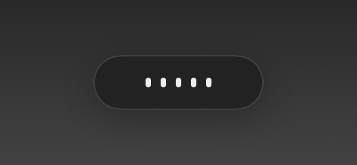

<div align="center">


# Phona

**Hold Option, speak, let go. Your words arrive corrected, where the cursor is.**

Local dictation with a grammar pass, for Apple Silicon Macs. No account, no API key,
no audio leaving your machine.


</div>

---

## What it does

You hold the Option key and talk. When you let go, phona transcribes what you said,
fixes the grammar, and pastes the result into whatever app you were in.

```
"there any way we can access these logs from the preference menu"
    -> Is there any way we can access these logs from the preference menu?

"we didn't found the root cause yet but we are investigating it since monday"
    -> We haven't found the root cause yet, but we have been investigating it since Monday.
```

The correction step is the point. Speech-to-text alone gives you exactly what you said,
including every dropped auxiliary and tense slip. That is fine for notes and wrong for a
pull request comment.

## Why local

Everything runs on your Mac. Whisper for speech, a 4B language model for the grammar
pass, both on Apple's MLX. Your voice never reaches a server, so it is safe for work you
would not paste into a web form.

It is also fast, because there is no network round trip. Measured on an M-series Mac
after warmup:

| Stage | Time |
| --- | --- |
| Transcription, short utterance | ~0.75 s |
| Grammar pass | ~0.40 s |
| **Total, from releasing Option to text appearing** | **~1.2 s** |

## Requirements

- Apple Silicon Mac (M1 or later). The models need MLX, which is Apple Silicon only.
- macOS 14 or later.
- About 4 GB of disk for the models, downloaded once.

## Install

```bash
git clone https://github.com/basal-john/phona.git
cd phona
./install.sh
```

That installs the speech engine and downloads the models. Then build and open the app:

```bash
cd macapp && ./build.sh && open build/Phona.app
```

Or grab `Phona.dmg` from [Releases](../../releases), drag Phona to Applications, and run
`install.sh` from this repo for the engine.

### First run


Phona asks for two permissions and explains why:

- **Accessibility** so it can notice the Option key and type into your apps
- **Microphone** so it can hear you

Both are granted in System Settings, and the setup window ticks each one green the moment
it lands. Nothing else to configure.

Because the app is signed ad-hoc rather than with a paid Apple Developer ID, macOS shows
a warning the first time. Right click the app, choose Open, then Open again. Once only.

## Using it

Hold **Option** on its own, speak, release. That is the whole interface.

Option is watched, never remapped, so Option+click, Option+e and every other Option
shortcut keep working. A hold only counts after Option has been down alone for 250 ms with
no other key pressed, and pressing any key mid-hold cancels the dictation.

| While you hold | After you release | When it lands |
| --- | --- | --- |
|  |  |  |
| live waveform of your voice | transcribing and correcting | pasted at the cursor |

The waveform is your actual input level, not a decorative loop. If it stays flat while you
talk, the microphone is not picking you up.

### Modes

| Mode | What it does |
| --- | --- |
| **Grammar** | Fixes grammar, agreement, tense and punctuation. Keeps your wording. |
| **Polish** | Also strips filler words and splits run-on sentences. |
| **Transcribe only** | No correction. Inserts exactly what was heard. |

Neither correcting mode uses an em dash, and neither swaps a clumsy phrase for a tidier one.
A clumsy phrase gets the smallest edit that makes it grammatical, so "announce this is in
the team" loses the stray "is" and keeps everything else, rather than becoming "make the
team aware of it". The cost is that a word which is wrong but real, "conform" where you
meant "confirm", now survives, since the corrector cannot tell it from a word you chose. Use
`replacements` for the ones you hit repeatedly.

### Layout

Count items off and they come back as a list. Saying "there are three things, first the
config needs an update, second the tests are failing, third someone has to review the PR"
gives you:

```
There are three things:
1. The config needs an update.
2. The tests are failing.
3. Someone has to review the PR.
```

For the rest, say the break you want as a sentence of its own:

| Say | Get |
| --- | --- |
| `new paragraph` | a blank line |
| `new line`, `next line`, `line break` | a line break |
| `bullet point`, `new bullet` | a new `- ` item |

A command only counts when it is a sentence on its own, so "we should start a new paragraph
here" is left as words. Anything not recognised is typed out rather than guessed at, on the
grounds that you can see and fix a stray "new line" but not a clause that silently vanished.
Turn the whole thing off with `spoken_layout` in Settings. Transcribe only mode never
applies it.

A long dictation also gets a paragraph break where you change subject, without being asked.
Only the words people actually use to turn a corner count, "so in the future", "separately",
"secondly", "regarding", and only past about 45 words. That deliberately misses breaks
rather than inventing them: a break in the middle of a thought is worse than none. Measured
over 466 real dictations, six were split and 460 were left exactly as they were.

The correction model was asked to do this in its prompt from the beginning and would not,
including when the rule was made unmissable and shown a worked example. Six real dictations
of 25 to 58 seconds came back as one block both times, which is why it is done in code.

Em and en dashes are replaced with commas for the same reason. The model inserts them into
otherwise clean sentences and will not stop when told, so the substitution happens after it
has finished rather than being asked for. Between two digits the mark is a range and becomes
a hyphen instead, so "2024 to 2026" does not turn into two separate years. Hyphens the model
leaves alone are never touched, since compound words are spelled with them.

### Chat apps end without a full stop

Nobody types a full stop at the end of a Slack message, so a dictated one reads stiffer than
anything you would have written by hand. Dictate into a chat app and the closing stop is
dropped:

| Say | Get |
| --- | --- |
| "I pushed the fix, the tests are green" | `I pushed the fix. The tests are green` |
| "can you check the staging build" | `Can you check the staging build?` |

Only the last mark of the message, and only when it is a full stop. Stops between sentences
stay, because they are what separates one thought from the next. A question mark or an
exclamation mark carries meaning a full stop does not, so both are left alone. An ellipsis is
a tone rather than a sentence end. An abbreviation keeps the stop that belongs to it, so
"it is 11:30 a.m." is untouched, and a message containing a list is left alone entirely,
since stripping the stop off the final item only would read as a bug.

Slack, Discord, WhatsApp, Teams and Messages count, and so do the same sites in a browser,
recognised from the window title. The title has to match a whole segment of it, so a GitHub
page about `slack-notifier` is not mistaken for Slack. A browser that will not report its
title is treated as not a chat app, which errs toward leaving your punctuation alone.

Measured over 271 real dictations: 159 would lose their closing stop, 112 were left exactly
as they were, and the single message ending in an abbreviation kept its own.

Which app is in front is read when Option goes down rather than when the text comes back,
because that is the app you were talking into. Turn it off with **Drop the closing full
stop** in Settings, which takes effect on the next dictation rather than needing a restart.
Transcribe only mode never applies it.

### Everything else goes quiet

Music, a video in a browser tab or a voice on a call reaches the microphone through the
room, and the transcriber cannot tell that speech apart from yours. It hears both and writes
down whichever it found more convincing.

So the output device is muted while you are being recorded, and set back the moment you let
go. It is muted when the first audio buffer arrives rather than when Option goes down, which
is a few hundred milliseconds later, so the start cue is still audible and everything that
reaches the recording is already quiet.

Muting the device rather than pausing players is what makes it work for every source. macOS
has no way to duck other applications, and pausing means knowing every app that could be
playing. Note that this includes call audio: dictate during a meeting and you stop hearing
the room for as long as you hold Option.

Turn it off with **Mute other audio** in Settings. If Phona is killed mid-dictation the
volume is put back at the next launch, so a crash cannot leave the Mac silent.

### Menu bar

Recent dictations, click one to copy it back. Hover to see what the transcriber actually
heard before correction, which is how you tell a mishearing from a bad correction.

Phona also keeps a Dock icon. Turn it off with **Show Phona in the Dock** and it lives in
the menu bar alone.

### Settings

Vocabulary for words the transcriber mangles, literal replacements applied before the
layout pass (`jeera = Jira`), correction mode, spoken layout commands, the closing full stop
in chat apps, muting other audio, the Dock icon, and open at login.

## How it works

```
Option held
  -> AVAudioEngine captures 16 kHz mono, and publishes a live level for the waveform
  -> silence gate rejects a near-silent take before it reaches the model
  -> Whisper large-v3-turbo transcribes
  -> repetition guard discards degenerate output
  -> Qwen3-4B rewrites it as correct English
  -> layout settles, and a chat app loses the closing full stop
  -> pasted at the cursor, clipboard restored
```

The Swift app owns the interface and the audio. A small Python daemon holds the two models
warm in memory and answers over a unix socket, which is what keeps a dictation at about a
second instead of reloading several gigabytes each time.

**Why Whisper and not Parakeet**, which is faster: on 12 sentences with deliberate grammar
errors, Whisper preserved them for the correction stage to fix, while Parakeet silently
repaired two during transcription. A transcriber that quietly fixes your grammar destroys
the signal the correction stage exists to catch. Speed lost that argument to fidelity.

The daemon prefills a KV cache with the fixed prompt prefix, which cut the grammar pass
from 1.35 s to 0.40 s.

## The models, and why these ones

| Job | Model | Size | Why |
| --- | --- | --- | --- |
| speech | `mlx-community/whisper-large-v3-turbo` | 1.5 GB | chosen over Parakeet on a measured comparison, see below |
| grammar | `mlx-community/Qwen3-4B-Instruct-2507-4bit` | 2.1 GB | picked as a sensible default and never benchmarked against alternatives |

The speech choice was earned. Parakeet TDT is roughly five times faster, and it lost
anyway: on twelve sentences with planted grammar errors it silently repaired two during
transcription, which destroys the signal the correction stage exists to catch. Whisper
preserved all twelve. Fidelity beat speed because the correction stage cannot fix an error
it never sees.

The grammar choice was not earned in the same way. Qwen3-4B was picked because it follows
instructions well at 4-bit, fits comfortably in memory, and answers in well under a second.
Those are reasonable criteria, and no alternative was ever measured against it. Treat it as
a default that works rather than a winner, and see `tests/run_model_tests.py` for the suite
that would settle it.

Both are swappable. Any mlx-community Whisper or mlx-lm chat model will load:

```bash
phona models                  # what is loaded, and at which revision
```

Edit `stt_model` or `llm_model` in `config.json`, then `phona restart`. A larger grammar
model raises quality and roughly doubles latency. A smaller Whisper is faster and mishears
more, which matters more here than it would elsewhere.

### Model updates are pinned deliberately

The loaders resolve the hub on every load, with no revision pinned, so a restart could
silently pick up whatever a model repo's main branch now points at. New weights can change
transcription and correction behaviour, and finding that out by accident is not acceptable
for something you dictate work into.

So once a model is fully cached, Phona resolves it to a local snapshot directory and hands
the loader that path instead of the repo name. No hub lookup happens at all, and the log
states exactly what was loaded:

```
pinned mlx-community/whisper-large-v3-turbo @ a4aaeec0636e
pinned mlx-community/Qwen3-4B-Instruct-2507-4bit @ 50d427756c6b
```

Updating is a decision, not a side effect:

```bash
phona update-models           # fetch newer weights, then restart
```

Set `pin_models` to `false` in `config.json` if you would rather always track the latest.

The obvious approach, setting `HF_HUB_OFFLINE`, does not work. `huggingface_hub` freezes
that flag into a module constant the first time it is imported, so setting it at runtime
only takes effect by luck of import order. It also makes `mlx_whisper` refuse a snapshot
that is missing any file at all, including a README, which is not a reason to stop working.
Resolving the path sidesteps both problems.

## Accuracy

Measured, not asserted. The suite covers three groups: sentences with planted errors,
sentences that are already correct (to catch over-correction), and regression cases from
earlier fixes.

Current state on 29 sentences: 23 exact matches against the expected output. Most of the
remaining six are acceptable paraphrase rather than errors, for example `anyone` where the
expectation said `anybody`.

Dictation is often an instruction aimed at a colleague, and a small model will happily
carry it out and hand back an answer instead of correcting the sentence. Saying "can you
send me the summary" once produced a preamble and a quoted rewrite that was never spoken.
Three guards now sit in front of that: a few-shot showing a request being corrected rather
than obeyed, a size check, and a similarity check against the original, which is what
catches a translation or a curt answer that keeps the length while replacing the words. A
list gets a tighter size budget than ordinary text, because layout is allowed to add
structure but never content, and that is what stops the model padding an enumeration with
items nobody said. If all of it fails, the transcript is tidied and returned, because your
words are always safer than invented ones.

The waiting is the two models and almost nothing else. Measured from releasing Option to the
text landing: 31 ms to close the device and hand off, 95 ms of daemon overhead, **1670 ms of
Whisper and Qwen**, 21 ms to paste. Whisper is near constant at about 0.8 s whatever the
length of the recording. The correction scales with how much you said, 0.6 s under fifteen
words and 2.5 s past forty, because it generates a token at a time. Run the app with
`--trace-timing` to get that breakdown in the log for your own dictations.

The cues are inaudible on an idle Bluetooth speaker. They run 215 to 260 ms and a Bluetooth
output that has gone quiet takes about half a second to start carrying audio again, so the
sound is over before the link is up. Wired and built-in output are fine, and so is Bluetooth
while something else is already playing. Left alone deliberately, since the alternatives are
padding every cue with silence or holding an audio stream open all day.

Known weak spots, all in the correction stage rather than the transcription:

- A single short invented list item can fit inside the size budget. Two do not
- An unpunctuated dictation whose layout command the model neither converts nor closes off
  as a sentence leaves the words in, for example a bare "new line" mid-clause
- Two clearly separate topics in one dictation get no blank line unless you say
  `new paragraph`. Pause length would be the better signal and is not used yet

- Occasional slips on `since` versus `for` with unusual duration phrasing
- `rollback` used as a verb where `roll back` is correct
- Mild over-correction on sentences that were already fine, for example
  `the deployment finished` becoming `the deployment is finished`
- Homophones the transcriber gets wrong are invisible to the corrector, because it only
  ever sees text. Say "log" and get "logo" and the grammar pass has no reason to object.
  The replacements list exists for the ones you hit repeatedly.

## Your data

Everything stays on your Mac, in `~/.local/share/phona`:

| File | What is in it |
| --- | --- |
| `history.jsonl` | every dictation, in plain text, with what was heard and what was returned |
| `corrections.jsonl` | the ones you flagged as wrong |
| `config.json` | your settings, vocabulary and replacements |
| `phonad.log`, `app.log` | diagnostics |

Worth being explicit about, because it is the obvious consequence of a local tool and
still a surprise if nobody says it: the history is a plain text record of everything you
have dictated, readable by anything running as you. Nothing is encrypted and nothing is
uploaded. Delete `history.jsonl` whenever you like, the app recreates it.

Audio is not kept. Each recording is written to a temporary file and deleted as soon as it
has been transcribed.

## Updating

```bash
cd phona && ./update.sh
```

Pulls, rebuilds the app, refreshes the engine and restarts it. Your settings, history and
flagged corrections live in `~/.local/share/phona` and are never touched. Permissions carry
over, because the signature is pinned to the bundle identifier rather than to the build.

Phona also checks the releases feed once a day and adds an "Update available" item to the
menu when there is something newer. It never installs anything on its own. An app holding
Accessibility access should not replace its own binary without being asked, and without a
Developer ID signature there is no chain of trust that would make doing so reasonable.

## Keeping it honest

Dictation goes wrong in ways the log cannot see on its own. It records what was heard and
what was returned, never what you meant, so a mishearing between two real words is
invisible to it.

When a dictation comes out wrong, flag it:

```bash
phona wrong "what I actually said"     # the text is optional
```

Or use *Mark last dictation as wrong* in the menu bar. That is the only ground truth the
tool gets, and it is what makes the audit useful rather than guesswork.

```bash
~/.local/share/phona/venv/bin/python ~/.local/share/phona/audit.py --days 7
```

The audit separates what it knows from what it guessed: entries you flagged, takes the
silence gate discarded and corrections the guard refused are facts the daemon recorded,
while suspected mishearings come from the local model and are labelled as inferences. It
proposes replacements and applies none of them until you say so. A weekly run lands in
`~/.local/share/phona/audit-latest.md` on Monday mornings.

Analysis uses the same local model as everything else, so a scheduled audit does not
quietly start uploading your dictations.

## Tests

```bash
python -m pytest tests/ -q          # logic and packaging, no model needed
cd macapp && swift test             # version comparison
python tests/run_model_tests.py     # the grammar suite, needs the engine running
```

The split is deliberate. The first two run in CI on every push, on an Apple Silicon
runner, in a couple of minutes. The third needs the warm daemon and several gigabytes of
models, so it stays local and is run before touching the prompt, the few-shot examples or
the guard.

Every case corresponds to a defect that actually happened. The suite is not there for
coverage, it is there so the same mistake cannot ship twice:

| Test | The bug it prevents |
| --- | --- |
| guard rejects the model acting on the text | a dictated request came back as an answer with invented text |
| guard accepts real corrections | the guard over-firing and discarding good rewrites |
| tidy capitalises and closes sentences | a rejected correction returned a raw lowercase transcript |
| common word proposals require context | the audit proposing `con = cron`, which corrupts "con man" |
| guarded entries read the recorded flag | the audit counting punctuation-only fixes as refusals |
| the audit asks the model, not the corrector | every inferred mishearing silently dropped, because the corrector is built to never answer |
| signature is pinned to the identifier | every rebuild silently orphaning the Accessibility grant |
| every cue is bundled | the start sound falling back to a macOS alert |
| screenshots are opaque | the README unreadable in GitHub's dark theme |
| bundle version matches the git tag | the app reporting 1.0.0 while the release said 1.1.0 |
| installer copies every module | a fresh install arriving with no audit |
| a page named after a chat app is not chat | a GitHub page about `slack-notifier` styling a comment box as a message |
| the style reaches the engine from the request | the chat style silently never applying, as an ordinary full stop |

What CI cannot cover, and why: anything needing a granted permission, a microphone, or the
language model. The TCC bug that cost an hour this morning is invisible to any test that
does not run on a real machine with real grants. That gap is real and worth knowing rather
than papering over.

## Troubleshooting

**Nothing happens when I hold Option.** Check Accessibility is granted, in the menu bar
under Setup and permissions.

**The waveform stays flat.** Wrong input device, or Microphone is not granted. Try Warm
microphone from the menu.

**The first dictation after a reboot comes back empty.** A cold input device takes about
four seconds to start producing audio. The app warms it at launch, so this should not
happen, but Warm microphone forces it.

**It pasted into the wrong place.** Phona pastes into whatever had focus when you released
Option.

**Nothing appeared, and the menu bar says it is on the clipboard.** There was nowhere for
the text to go, so it was kept rather than inserted. Press Cmd+V where you want it. The
capsule shows a clipboard glyph instead of a checkmark in that case, and the cue is the
quiet one rather than the completion chime.

Pasting cannot be verified: posting Cmd+V reports that the event was sent, never that
anything consumed it. So Phona asks Accessibility whether an editable element is focused,
and only puts your previous clipboard back when the answer is yes. Where the answer is
uncertain, which is common in Electron apps that expose little of their hierarchy, the
dictation stays on the clipboard. Losing what you said is worse than leaving a clipboard
changed.

**My output stayed muted.** Phona mutes the output device while it records and restores it
when you let go, and puts it back at the next launch if it was killed in between. To see
which control your device offers and watch a mute and a restore go through:

```bash
/Applications/Phona.app/Contents/MacOS/PhonaApp --check-mute
```

**The capsule shows scissors.** The transcriber started looping and the repeated tail was
cut off, so what landed is real but may be shorter than what you said. One dictation came
back as 29 real words followed by "balloon" 219 times. The whole transcript, tail included,
is in `~/.local/share/phona/app.log`. The menu bar says how many words were cut.

**Phona says the microphone delivered no audio.** The input device produced not one buffer
for the entire recording. That is the capture layer, not Phona, and not you being quiet.
Check System Settings, Sound, Input and watch the level meter while you speak. If it is dead
there too:

```bash
sudo killall coreaudiod
```

All audio cuts for about a second and launchd restarts it. A wedged Core Audio enumerates
every device as healthy and hands out silence, so nothing else gives it away.

**The capsule shows a warning triangle and the menu bar keeps a mark.** Something failed
rather than came back empty. The mark stays until a dictation succeeds, so a breakage that
persists looks like it. The reason is in `~/.local/share/phona/app.log`, on the line
beginning `daemon error`.

If it reads `No such file or directory: 'ffmpeg'`, the engine cannot find ffmpeg. Whisper
shells out to it by name, and an app opened from the Dock, from Spotlight or as a login
item is handed a PATH with no Homebrew in it, which the engine inherits. Phona now looks in
the usual Homebrew locations itself, so this needs an actual missing ffmpeg to happen:

```bash
brew install ffmpeg
```

The engine names the binary it settled on at every start, so its log says which one is in
use:

```bash
grep ffmpeg ~/.local/share/phona/phonad.log
```

**Logs.** `~/.local/share/phona/app.log` for the app, `phonad.log` for the engine, and
`history.jsonl` for every dictation with what was heard next to what was corrected.

**The Option key stopped working after a rebuild.** It should not any more, but this is
worth knowing. An ad-hoc signature's designated requirement is the code hash itself, so
macOS binds a permission grant to one exact build and every rebuild silently orphans it.
The permission keeps showing as enabled in System Settings while the app is denied, and
nothing logs a reason. `build.sh` pins the requirement to the bundle identifier instead,
which keeps grants valid across rebuilds. If a grant ever does go stale, clear it and
grant again:

```bash
tccutil reset Accessibility com.basalona.phona
tccutil reset Microphone com.basalona.phona
```

## Credits

Built after looking hard at [Spokenly](https://spokenly.app), Willow and Lemon, which
solve the same problem with different tradeoffs. Phona is the local-only, keyboard-first
take: no account, no cloud models, and the grammar pass treated as the main feature rather
than an add-on.

Speech and correction both run on [MLX](https://ml-explore.github.io/mlx/), using
mlx-whisper and mlx-lm with Qwen3-4B.

## License

MIT. See [LICENSE](LICENSE).
